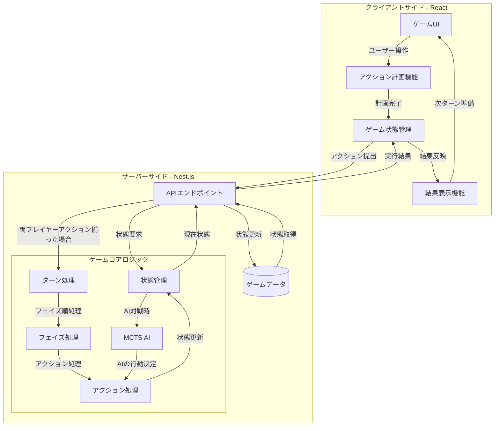

# ヌルポガ TCG アーキテクチャ

## システム概要
ヌルポガ TCGは同時決定・同時実行型のターン制デジタルカードゲームです。プレイヤーは相手の行動を知ることなく各フェイズでのアクションを計画し、両プレイヤーの計画が提出された後にサーバーで処理が実行されるという戦略性の高いゲームシステムを採用しています。

## 技術スタック
- フロントエンド: React
- バックエンド: Nest.js
- データ形式: JSON
- 通信プロトコル: HTTP/HTTPS

## コンポーネント説明

### クライアントサイド
- **ゲームUI**: プレイヤーとのインタラクションを担当する画面コンポーネント群
- **アクション計画機能**: 各フェイズでのプレイヤーの行動を決定するUI
- **ゲーム状態管理**: クライアント側でのゲーム状態保持と更新
- **結果表示機能**: アクション実行結果のアニメーションと表示

### サーバーサイド
#### APIエンドポイント:
- `/game_state/{user_id}`: ゲーム状態取得
- `/submit_actions/{game_id}/{user_id}`: アクション提出
- `/execute_actions/{game_id}`: アクション実行

#### ゲームコアロジック:
- **状態管理**: ゲーム全体の状態（State）と個別プレイヤー（Player）の状態管理
- **ターン処理**: ターン開始、終了処理
- **フェイズ処理**: スペル、進軍召喚、行動フェイズの処理
- **アクション処理**: 各種アクション（カード使用、攻撃など）の処理
- **MCTS AI**: CPU対戦用のモンテカルロ木探索AI

## データフロープロセス
1. プレイヤーは各フェイズのアクションをUIで計画（相手の計画を見ることなく）
2. 計画完了後、アクションをサーバーに提出
3. 両プレイヤーのアクションが揃うとサーバーで処理を実行
   - ターン開始処理
   - スペルフェイズ処理（カードナンバー順、不発条件の確認）
   - 進軍召喚フェイズ処理
   - 行動フェイズ処理（移動→攻撃の順）
   - ターン終了処理
4. 処理結果をクライアントに返し、UIに反映
5. 勝利条件判定（ライフ0、荒野状態の連続4マス）

この設計により、「見えない意思決定」と「同時実行」という戦略的要素をシステムとして実現しています。