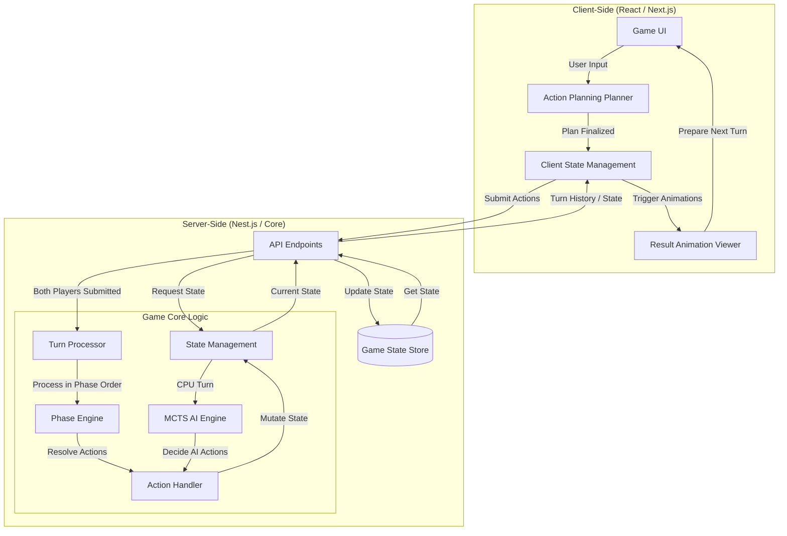

# Nullpoga TCG Architecture

## System Overview

Nullpoga TCG is a simultaneous-decision, simultaneous-execution digital collectible card game. Both players plan their actions concurrently without knowledge of the opponent's choices. Once submitted to the server, actions resolve deterministically in structured phase order.

## Tech Stack

- **Frontend**: React (Next.js) / TypeScript
- **Backend / Core**: Nest.js / TypeScript (`packages/core`)
- **Data Format**: JSON
- **Protocol**: HTTP/HTTPS / WebSockets (planned)

```mermaid
flowchart TB
    subgraph Client["Client-Side (React / Next.js)"]
        UI["Game UI"]
        GameState["Client State Management"]
        ActionPlanner["Action Planning Planner"]
        ResultViewer["Result Animation Viewer"]
    end

    subgraph Server["Server-Side (Nest.js / Core)"]
        API["API Endpoints"]
        subgraph Core["Game Core Logic"]
            State["State Management"]
            Turn["Turn Processor"]
            Phase["Phase Engine"]
            Action["Action Handler"]
            MCTS["MCTS AI Engine"]
        end
        DB[("Game State Store")]
    end

    UI --> |User Input| ActionPlanner
    ActionPlanner --> |Plan Finalized| GameState
    GameState --> |Submit Actions| API
    API --> |Request State| State
    State --> |Current State| API
    API --> |Update State| DB
    DB --> |Get State| API
    API --> |Turn History / State| GameState
    GameState --> |Trigger Animations| ResultViewer
    ResultViewer --> |Prepare Next Turn| UI
    
    API --> |Both Players Submitted| Turn
    Turn --> |Process in Phase Order| Phase
    Phase --> |Resolve Actions| Action
    Action --> |Mutate State| State
    State --> |CPU Turn| MCTS
    MCTS --> |Decide AI Actions| Action
```

## Component Breakdown

### Client-Side
- **Game UI**: Interactive board layout, hand area, stats, and action control buttons.
- **Action Planner**: Manages uncommitted temporary placements and target vectors for each phase.
- **Client State Management**: Tracks active board snapshot, hand cards, player life/mana, and server synchronization.
- **Result Animation Viewer**: Iteratively replays sequential state transitions (`turnHistory`) returned by the server.

### Server-Side
- **API Endpoints**:
  - `GET /api/game-state`: Retrieve current game room state.
  - `POST /api/player-action`: Submit planned actions (PvP).
  - `POST /api/player-action-with-cpu`: Submit planned actions with immediate CPU resolution.
- **Game Core Logic (`packages/core`)**:
  - `State`: Master game state model managing players, board zones, turns, and history.
  - `Turn Processor`: Coordinates the progression from turn start to turn end.
  - `Phase Engine`: Evaluates phases in order: Spell Sub-phases -> March/Summon Phase -> Activity Phase (Move -> Attack).
  - `Action Handler`: Applies card spells, summoning, unit displacement, and attack resolutions.
  - `MCTS AI`: Monte Carlo Tree Search engine for CPU opponent decision-making.

## Data Flow & Turn Lifecycle

1. **Planning**: Both players plan actions locally across all three phases without seeing opponent plans.
2. **Submission**: Players send action batches (`spellPhaseActions`, `summonPhaseActions`, `activityPhaseActions`) to the server.
3. **Deterministic Resolution**: Once both submissions are received, the server executes:
   - Turn Start effects, mana increment (+1), and card draw.
   - Spell Phase sub-phases (ordered by ascending `cardNo`, evaluating fizzle condition on identical cards).
   - March/Summon Phase (simultaneous summon to Standby Zone, followed by march into Battle Zone).
   - Activity Phase (all movement resolves first, followed by combat attacks).
   - Turn End cleanup and victory condition evaluation (Life <= 0 or 4 contiguous Wilderness zones).
4. **Playback**: Server returns final state alongside step-by-step history (`turnHistory`). The client visualizes each step with sequential animations.